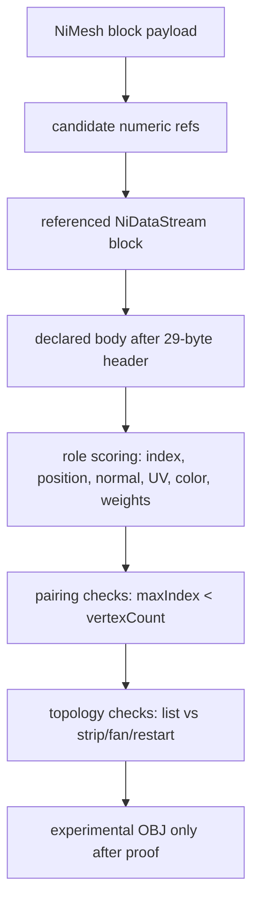

# Aggressive Evidence Workflow — RIFT geometry discovery 🚀

Date: 2026-05-07

This document defines the approved working mode for this repository: **optimize for maximum real discovery speed, not maximum reckless output**.

The goal is to move quickly toward verified RIFT model/geometry decoding while preserving the safety gates that prevent false format claims, accidental asset commits, privacy leaks, and misleading exports.

## Operating principle 🧭

> Fast discovery comes from repeatable evidence, not bigger guesses.

For RIFT asset reverse engineering, the fastest path is:

```text
small focused probe → smoke run → full copied-set inventory → ranked evidence → documented truth → commit → next lead
```

The slow path to avoid is:

```text
format guess → speculative decoder → plausible-looking bad output → debugging confusion → rewrite
```

## Current strongest geometry truth 🔬

| Evidence | Current result | Meaning |
|---|---:|---|
| Copied payloads inspected | `40,203` | Current copied archive sample size |
| NIF payloads | `5,111` | Gamebryo/NIF is the real model-format lead |
| Parsed `NiDataStream` blocks | `31,777` | Stream bodies are abundant enough for full-set ranking |
| Proven stream header rule | `29` bytes for all parsed data streams | Body boundary is evidence-backed |
| Big-endian `uint16` lead bodies | `5,551` | Large repeated index-like family |
| Big-endian triangle-aligned bodies | `5,481` | Many compact streams divide into index triples |
| Triangle-strip less-degenerate bodies | `9,712` | Strong strip/fan/restart-style topology lead |
| Top compact signature | `payload=72`, `count=352`, first16 `00010002000200010003000400050006` | Highest-repeat small index-family target |

Interpretation: the current best geometry lead is **mesh stream binding**, not direct OBJ export. We need to prove which `NiMesh` payload fields point at which `NiDataStream` bodies, then assign stream roles.

## Safety gates that stay ON 🛡️

| Gate | Rule | Why it stays |
|---|---|---|
| Asset safety | Never commit `Source/`, `Extracted/`, or `Exports/` payload data | Prevents copied RIFT assets or generated dumps from going public |
| Privacy | Keep username/profile redaction enabled; scan tracked files before push | Prevents account-like local path leaks |
| Live install | Read-only only unless explicitly requested otherwise | Prevents damaging the live game install |
| Claims | Do not claim model/OBJ support until structure validates | Prevents misleading progress reports |
| Writes | Generated outputs go under ignored folders | Keeps repo clean and reviewable |
| Commit size | Commit stable milestones, not huge speculative rewrites | Enables rollback and fast review |

These gates are not meant to slow discovery. They remove expensive mistakes so the repo can move faster.

## Discovery cadence ⚡

Every high-speed cycle should follow this checklist:

| Step | Action | Required output |
|---:|---|---|
| 1 | Pick the strongest current lead | One concrete question, not a broad refactor |
| 2 | Add or improve one narrow CLI command | Small patch, minimal architecture churn |
| 3 | Run a smoke scan | Usually `--max-total 100` or one known asset ID |
| 4 | Run the full copied-set scan | Confirms whether the lead scales |
| 5 | Query JSON for ranked evidence | Tables of counts, top signatures, samples |
| 6 | Update docs | Current truth, command, interpretation, uncertainty |
| 7 | Validate | `dotnet build`, command smoke, privacy scan, `git diff --check` |
| 8 | Commit/push if stable | Small milestone commit |
| 9 | Immediately choose next lead | Avoid dead air after validation |

## Critical path: mesh stream binding 🧩

The next phase is to build a repeatable proof chain from `NiMesh` blocks to decoded geometry roles.



### Phase 1 — binding inventory

**Question:** Which `NiMesh` payload offsets repeatedly point at `NiDataStream` blocks?

Use or extend existing evidence from `inventory-nif-mesh-streams`.

| Target | Evidence to capture |
|---|---|
| Mesh block size | `NiMesh` payload size family, e.g. `325`, `321`, `214`, `193` |
| Candidate field offset | Byte offset inside the mesh payload, e.g. `@168`, `@216`, `@292`, `@300` |
| Referenced block index | Target `NiDataStream` block index |
| Stream block size | Full `NiDataStream` block size |
| Declared body bytes | First little-endian `uint32` in data-stream block |
| Ambiguity flag | Whether the same value may also be a string-table index |
| Pattern key | Stable grouping such as `meshSize=325 @216:size=317|@292:size=101?|@300:size=221` |

**Acceptance criteria:** top mesh-size/offset patterns produce stable counts across the full copied set.

### Phase 2 — stream role scoring

**Question:** For each referenced stream body, what role is most likely?

Planned scoring dimensions:

| Candidate role | Evidence |
|---|---|
| `index-u16be-strip-lead` | Even byte length, small max index, repeated big-endian values, strip less degenerate than fixed triples |
| `index-u16be-list-lead` | Length divisible by 6, low degenerate fixed triples, `maxIndex < pairedVertexCount` |
| `position-float3-lead` | Finite float triplets, sane bounding box, nonzero extent |
| `normal-float3-lead` | Float triples with vector length near `1.0` |
| `uv-float2-lead` | Float pairs mostly in a plausible UV-ish range |
| `color-u8/u32-lead` | Byte/uint32 patterns consistent with color channels |
| `weights/bones-lead` | Small integer groups plus normalized weight-like floats/bytes |
| `unknown-stream` | Insufficient or conflicting evidence |

**Acceptance criteria:** role scoring must report confidence and uncertainty, not just labels.

### Phase 3 — mesh-level pairing proof

**Question:** Can one `NiMesh` family be structurally decoded without guessing?

Minimum proof gate:

| Requirement | Why |
|---|---|
| Candidate index stream found | Needed for triangles or strips |
| Candidate position stream found | Needed for vertices |
| `maxIndex < vertexCount` | Core structural consistency check |
| Position stride is stable | Prevents accidental float reinterpretation |
| Bounds are finite and sane | Prevents byte-noise geometry |
| Topology choice lowers degeneracy or matches expected layout | Supports strip/list/fan inference |
| Repeats across multiple NIFs in same family | Avoids one-sample coincidence |

Only after this gate should experimental geometry export be considered.

### Phase 4 — probe report for one mesh

Planned command shape:

```powershell
dotnet run --project "C:\RIFT MODDING\Assets\src\RiftAssetDumper\RiftAssetDumper.csproj" -- probe-nif-mesh --root "C:\RIFT MODDING\Assets\Source" --id <assetId> --mesh-block <n> --out "C:\RIFT MODDING\Assets\Exports\probe-nif-mesh-<id>-mesh<n>.json"
```

Expected report sections:

| Section | Content |
|---|---|
| Mesh block | block index, size, first bytes, numeric fields |
| Candidate bindings | offset → stream block links |
| Stream bodies | header bytes, payload bytes, first bytes |
| Role scores | index/position/normal/UV/etc. hypotheses |
| Pairing checks | `maxIndex`, candidate vertex count, stride consistency |
| Topology checks | fixed triples vs strip/fan degeneracy |
| Confidence | evidence flags and blockers |

### Phase 5 — experimental export gate

Planned command shape only after proof:

```powershell
dotnet run --project "C:\RIFT MODDING\Assets\src\RiftAssetDumper\RiftAssetDumper.csproj" -- decode-nif-geometry --root "C:\RIFT MODDING\Assets\Source" --id <assetId> --mesh-block <n> --write-obj --experimental --out "C:\RIFT MODDING\Assets\Exports\geometry-experimental"
```

Export remains disabled unless all proof checks pass. If export is added, every OBJ should include a sidecar JSON report with the exact evidence used.

## Confidence language 📏

Use these terms consistently:

| Term | Meaning |
|---|---|
| `observed` | Directly parsed from bytes |
| `validated` | Reproduced by command output and sanity checks |
| `lead` | Repeated evidence suggests a meaning, but not proven |
| `candidate` | Possible interpretation needing more checks |
| `unsupported` | Not implemented or not safely proven |
| `experimental` | Explicit opt-in; output may be wrong and must include evidence sidecar |

Avoid saying “decoded” unless the bytes survive structural consistency checks.

## Automation target 🤖

The fastest safe version of the workflow should eventually be one command that runs the standard discovery suite and writes a small summary report:

```powershell
# planned
dotnet run --project "C:\RIFT MODDING\Assets\src\RiftAssetDumper\RiftAssetDumper.csproj" -- run-nif-discovery-suite --root "C:\RIFT MODDING\Assets\Source" --out "C:\RIFT MODDING\Assets\Exports\nif-discovery-suite"
```

Until then, run the focused commands manually and commit each stable milestone.

## Helper apps and optionized tooling 🧰

Build helper tooling ahead of bottlenecks, but prefer **optionized helpers** over many one-off apps.

| Rule | Practical effect |
|---|---|
| One helper, many modes | Add modes/options to a durable helper instead of creating a new helper app for every discovery question. |
| CLI-first | Keep the .NET dumper as the source of truth; helpers should orchestrate commands, not duplicate parsers. |
| Generated-output only | Helper reports/logs go under ignored `Exports/` unless explicitly promoted to docs. |
| Repeatable smoke/full runs | Helpers should run smoke and full copied-set scans with the same command shape every time. |
| Blocker-aware | If a full run fails, helpers should preserve the smoke output and failing command so the blocker is resumable. |
| Privacy-safe by default | Helpers should keep redaction on and offer privacy scans before commits/pushes. |

Current helper:

```powershell
powershell -NoProfile -ExecutionPolicy Bypass -File "C:\RIFT MODDING\Assets\scripts\Invoke-RiftAssetWorkflow.ps1" -Mode MeshBindings -Full -PrivacyScan
```

Focused one-mesh probe mode:

```powershell
powershell -NoProfile -ExecutionPolicy Bypass -File "C:\RIFT MODDING\Assets\scripts\Invoke-RiftAssetWorkflow.ps1" -Mode MeshProbe -Id c841eb9a0ed1c95e -MeshBlock 6
```

Design target: this script should become the optionized local workbench for discovery cycles. Add modes before adding separate scripts unless the new helper needs a genuinely different runtime surface.

## Immediate implementation plan 🎯

| Priority | Milestone | Deliverable | Exit criteria |
|---:|---|---|---|
| 1 | Mesh binding v2 | `inventory-nif-mesh-bindings` with role-ready JSON grouping | Full copied-set top patterns identify stable mesh size + stream size families |
| 2 | Helper workbench | Optionized workflow helper with smoke/full/privacy options | One command runs the current discovery cycle and summarizes output |
| 3 | Stream role inventory refinement | Improve role scoring for referenced streams only | Top patterns label likely index/position/normal/UV streams with confidence flags |
| 4 | Mesh probe | `probe-nif-mesh` | One known asset emits a complete mesh/block/stream/role report |
| 5 | Shifted/encoded role refinement | Rotate-right-1 float probes for coarse stream roles | `uint16-compatible-body` splits into normal/UV/position byte-rotated labels |
| 6 | Position source discovery | Probe `NiMesh` payload bytes and repeated position-bearing stream families | Indexed top family has index + normal + UV leads; separate attribute-set lane has position + normal + UV |
| 7 | Attribute-set topology proof | Determine whether position/normal/UV-only meshes are unindexed, implicit strips, or separately indexed | At least one complete attribute family has a ranked topology interpretation |
| 8 | Pairing proof | Strengthen `maxIndex < vertexCount` checks | At least one repeated family passes structural pairing across multiple assets |
| 9 | Topology proof | Add strip/list/fan/restart scoring | Top index family has a ranked topology interpretation |
| 10 | Experimental export | Add disabled-by-default OBJ export | Only writes when proof gates pass and `--experimental --write-obj` are explicit |

## Definition of done for each milestone ✅

| Check | Required? |
|---|---:|
| Build passes | ✅ |
| Smoke command passes | ✅ |
| Full copied-set scan passes when feasible | ✅ |
| Generated data remains ignored | ✅ |
| Privacy scan passes | ✅ |
| Docs updated with command/result/uncertainty | ✅ |
| Stable commit pushed | ✅ when the milestone is coherent |

## Optional top 10 next best recommended actions 🔟

1. Implement mesh binding v2 focused on `NiMesh` size/payload-offset patterns.
2. Add stream role scoring for only mesh-referenced streams, not every stream globally.
3. Prioritize `meshSize=325` and `meshSize=321` because they already show repeated three-stream patterns.
4. Use `payload=72`, `144`, `192`, and `288` as the first stream-body families for role pairing.
5. Add `maxIndex < vertexCount` pairing checks before any visual export.
6. Add bounding-box and float-vector sanity checks for position/normal candidates.
7. Add strip-window topology scoring to mesh-level reports, not just global stream inventories.
8. Create `probe-nif-mesh` before `decode-nif-geometry`.
9. Keep OBJ export explicit, experimental, and sidecar-evidence-backed.
10. Commit every validated discovery milestone before the next decoding leap.
