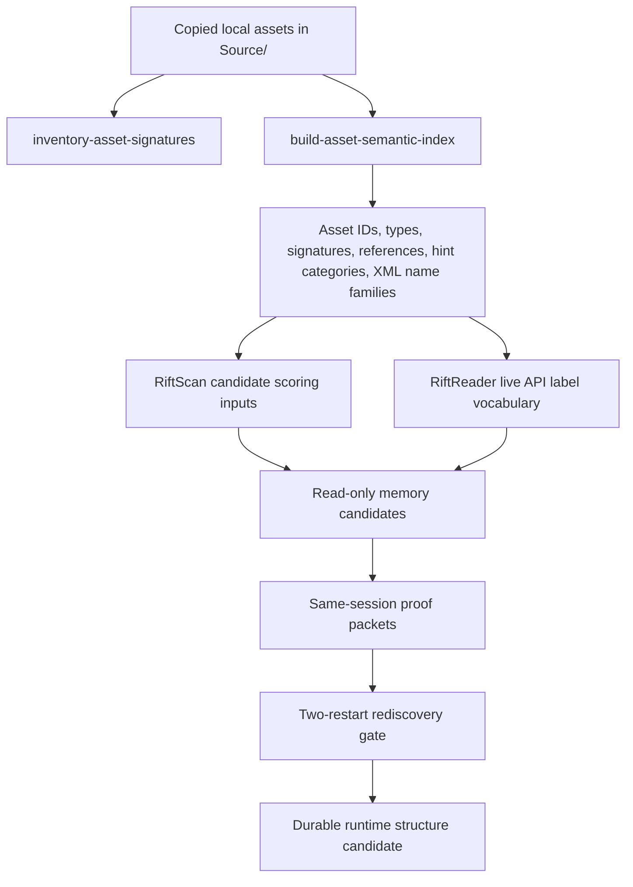

# Asset-guided Runtime Reacquisition Strategy 🧭

Date: 2026-05-07
Repo: `RiftAssetDumper`

## TL;DR

Local asset evidence should guide RiftScan/RiftReader reacquisition by providing **stable labels, identifiers, file signatures, model/texture references, map/zone hints, and candidate data families**. It must **not** promote exact runtime addresses, offsets, or process-local structures as durable truth.

The first implemented repo-local packet is:

```text
Exports/asset-semantic-index.json
```

It follows the draft schema:

```text
docs/schemas/asset-semantic-index-v1.schema.json
```

Generated indexes stay under ignored `Exports/` unless a tiny reviewed fixture or redacted aggregate is intentionally promoted.

## Current implementation surface

| Surface | Purpose | Safety status |
|---|---|---|
| `inventory-asset-signatures` | Archive-aware grouping of all local copied payload signatures, including non-NIF/DDS types. | Generated JSON under `Exports/`; no extracted payloads written. |
| `build-asset-semantic-index` | Per-asset index with asset IDs, manifest metadata, detected type, signatures, semantic hint categories, category filters, XML tag/attribute name counts, XML parse status/boundary metadata, candidate names, and bounded reference/snippet samples. | Generated JSON under `Exports/`; hints are leads, not truth; XML values/text/raw parse messages are not stored. |
| `AssetSignatures` workflow mode | Smoke/full wrapper for signature inventory. | Safe for repeated local scans. |
| `AssetSemanticIndex` workflow mode | Smoke/full wrapper for semantic index generation. | Use bounded smoke first; full runs may be large. |
| `docs/schemas/asset-semantic-index-v1.schema.json` | Draft contract for generated semantic index packets. | Committed schema only; no asset content. |

## Truth boundaries

| Layer | Durable? | What it can say | What it cannot say |
|---|---:|---|---|
| Asset signature truth | ✅ Mostly durable for the same client asset set | Payload type, size, signature groups, manifest/asset IDs. | Runtime memory location or loaded object layout. |
| Asset semantic hint | ⚠️ Lead only | A payload contains bounded strings/references that look like map, UI, quest, objective, waypoint, actor, model, texture, or audio clues. | That the payload is definitively a quest/map schema without parser proof. |
| Asset reference graph | ✅ Durable once parsed/repeated | Model-to-texture references, candidate names, asset ID relationships. | Runtime object identity or live actor ownership. |
| RiftScan candidate | ❌ Session-local until reproven | A memory region currently resembles an asset-guided candidate. | Durable offset or address after restart. |
| RiftReader API label | ✅ Live label for the current observation | Current API names/IDs/coordinates can label scan samples. | Asset schema proof or cross-restart memory durability by itself. |
| Reacquired runtime structure | ⚠️ Requires proof gate | Candidate survived repeated readback and restart validation. | Durable truth before two-restart rediscovery and guard review. |

## Recommended data flow



## Priority semantic lanes

| Priority | Lane | Asset-side signal to collect | Runtime use |
|---:|---|---|---|
| 1 | Zone/map coordinate systems and bounds | Map/zone/world/terrain/bounds strings, structured numeric tables, file signature families. | Score candidate coordinate transforms and reject impossible bounds. |
| 2 | Waypoints/objectives/POIs | `waypoint`, `objective`, `quest`, `poi`, journal/task strings and table-like payloads. | Label candidate objective/POI memory records and route targets. |
| 3 | Actor/model/object IDs | NIF model IDs, object-like strings, NPC/creature/character references, model-texture graph. | Join live actor/API labels to asset-backed model/object families. |
| 4 | UI/Lua/XML payloads | Text payloads or binary records with Lua/XML/interface/addon/frame hints. | Find client-side naming conventions and table schemas without live memory writes. |
| 5 | Audio/VFX side references | RIFF/OGG signatures, VFX/model/audio path references. | Secondary labels for world objects, encounters, and actor families. |

## Gamebryo/NIF handling notes

- Treat RIFT `20.6.0.0` NIFs as Gamebryo `NiMesh` / `NiDataStream`-first assets, not as old `NiTriShape`-only layouts.
- Preserve raw escaped block-type names, but normalize `NiDataStream<SOH>usage<SOH>access` variants to the `NiDataStream` family with explicit `DataStreamUsage` and `DataStreamAccess` fields.
- Prefer semantic labels from texture paths, object names, material/source strings, extra data, and stream semantics before any exporter-oriented geometry conversion.
- Keep local NIF coordinates/transforms separate from zone/map coordinates until validated against placement/map payloads or live labels.

## Reacquisition rule set

1. **Asset evidence proposes labels; runtime evidence proves structure.**
2. **Never treat exact runtime addresses as durable.** A valid asset-guided candidate still needs current PID/process proof.
3. **Require repeated observations.** Single-pose or one-session hits remain candidates.
4. **Require two-restart rediscovery before durable runtime claims.** A candidate must be rediscovered from labels/scoring, not copied from an old address.
5. **Keep false positives visible.** Semantic categories named `hint:*` are search leads; they are not parser-backed schemas.
6. **Fail closed on guard weakening.** Asset schema, proof guard, cross-repo contract, or runtime promotion changes require high/extra-high reasoning review.
7. **Keep generated content ignored.** Full indexes belong in `Exports/`; committed docs should use aggregate counts and sanitized examples only.

## Command examples

Smoke signature inventory:

```powershell
powershell -NoProfile -ExecutionPolicy Bypass -File "C:\RIFT MODDING\Assets\scripts\Invoke-RiftAssetWorkflow.ps1" -Mode AssetSignatures -SmokeMaxTotal 500 -SkipBuild
```

Smoke semantic index:

```powershell
powershell -NoProfile -ExecutionPolicy Bypass -File "C:\RIFT MODDING\Assets\scripts\Invoke-RiftAssetWorkflow.ps1" -Mode AssetSemanticIndex -SmokeMaxTotal 200 -SkipBuild
```

Filtered XML/map-zone semantic triage:

```powershell
powershell -NoProfile -ExecutionPolicy Bypass -File "C:\RIFT MODDING\Assets\scripts\Invoke-RiftAssetWorkflow.ps1" -Mode AssetSemanticIndex -Type xml -SemanticCategory hint:map-zone -SmokeMaxTotal 200 -SkipBuild
```

Python discovery matrix for batched, bounded semantic/signature runs:

```powershell
python "C:\RIFT MODDING\Assets\scripts\rift_asset_discovery_matrix.py" --skip-build --jobs signature-baseline semantic-xml-map-zone semantic-bin-waypoint-poi --privacy-scan
```

Direct generated semantic index output:

```powershell
dotnet run --project "C:\RIFT MODDING\Assets\src\RiftAssetDumper\RiftAssetDumper.csproj" -- build-asset-semantic-index --root "C:\RIFT MODDING\Assets\Source" --max-total 200 --out "C:\RIFT MODDING\Assets\Exports\asset-semantic-index.json"
```

## Current limitations

| Limitation | Impact | Next fix |
|---|---|---|
| Semantic hint extraction is intentionally heuristic. | `hint:*` categories can include binary false positives. | Add parser-backed classifiers per signature family before promoting schemas. |
| Full semantic index or wildcard `hint:*` scans across all binary payloads can be CPU-heavy. | Use smoke/bounded scans first and prefer type/category filters such as `--type xml --semantic-category hint:map-zone`. | Add category-aware prefiltering and split JSONL output if needed. |
| XML tag/attribute family counts are name-only and can be partial if the lightweight XML reader hits malformed/trailing bytes. | They are stronger than raw string hints but still not schema proof. | Add focused XML payload probes that preserve tag/attribute names only and report parse boundaries. |
| Lua/UI/quest payloads are not yet proven as first-class parsed files. | Search hits are leads only. | Prioritize archive-aware text-family discovery and exact payload probes. |
| No cross-repo edits are made here. | RiftScan/RiftReader consumption remains a design contract until explicitly implemented. | Add consumer-side import only after this schema stabilizes. |

## Done criteria for durable promotion

A runtime structure may only move from candidate to durable when all are true:

- asset-side labels or IDs are reproducible from the semantic index;
- RiftScan can rediscover the candidate without using a stale exact address;
- RiftReader or another live API source provides current-session labels for validation;
- two independent restarts rediscover the same structure family;
- proof artifacts preserve PID/process/session metadata;
- guards fail closed if old-session evidence is accidentally reused.
